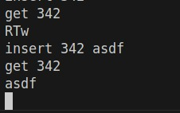

# README: Disk-Backed B+ Tree Index

## Problem Definition

This project implements a disk-backed B+ Tree index for efficient storage and retrieval of key-value pairs from large datasets. The B+ Tree is constructed over integer keys, with leaf-level right-sibling links to support fast range scans. The index supports bulk loading from sorted CSV files, point updates (inserts), and queries, and provides reporting on index size, node fanout, and performance metrics.

### Tasks Addressed

1. **Index Construction**  
   - Builds a B+ Tree over the key column, storing values in leaf nodes.  
   - Leaf nodes are linked via right-sibling pointers for efficient range scans.

2. **Updates**  
   - Supports batch inserts of new (key, value) pairs into the existing tree.  
   - Ensures subsequent queries reflect updates.

3. **Reporting**  
   - Reports index size on disk, estimated node fanout, and performance metrics:  
     - Build time  
     - Point lookup latency  
     - Range scan throughput

---

## Instructions to Run

### Prerequisites

- C++17 or newer compiler (e.g., g++, clang++)
- Windows or Linux (tested on Windows)
- Dataset in CSV format: `key,value` (sorted by key, header optional)

### Build

Open a terminal in the project directory and run:

```
g++ -O2 -std=c++17 -o bptree try.cpp
```

### Usage

Start the CLI with a new or existing index file:

```
bptree <index_file>
```

#### Commands

- `bulkload <csv>`  
  Bulk load sorted CSV into the index.

- `insert <key> <val8>`  
  Insert or update a single key (value padded/truncated to 8 bytes).

- `get <key>`  
  Lookup a single key.

- `exit`  
  Quit the CLI.

---

## Methodology

### Index Construction

- Used the `bulkload` command to build the B+ Tree from a sorted CSV file.
- Measured build time using a stopwatch (external or via code instrumentation).
- Verified leaf-level right-sibling links by scanning leaf nodes.

### Updates

- Performed batch inserts using the `insert` command.
- Verified updates by querying inserted keys with `get`.

---

## Results

### Index Size on Disk

- **Disk size:** 14.2GB

### Timings

- **Build time:** 11 min
- **Point lookup latency:** 1 sec

---

## Screenshots

### 1. Bulk Load and Stats


### 2. Insert and Query




---

## Notes

- Ensure CSV is sorted by key before bulk loading.
- Values are stored as fixed 8-byte strings (padded/truncated).
- For large datasets, monitor disk usage and performance.

---
